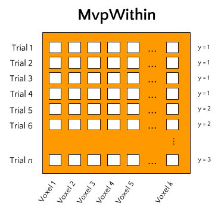

Mvp-objects
-----------
One of skbold's main features is the data-structure ``Mvp`` (an abbreviation
of MultiVoxel Pattern). This custom object allows for an efficient way
to store and access data and metadata necessary for multivoxel analyses of fMRI data.
A nice feature of this ``Mvp`` objects is that they can easily load data
(i.e., sets of nifti-files) from disk and automatically organize it in
a format that is used in ML-analyses (i.e., a sample-by-feature matrix).

So, at the core, an ``Mvp``-object is simply a collection of data - a 2D array
of samples by features - and fMRI-specific metadata necessary to perform
customized preprocessing and feature engineering. However, machine learning
analyses, or more generally any type of multivoxel-type analysis (i.e. MVPA),
can be done in two basic ways, which provide the basis of the two 'flavors'
of ``Mvp``-objects: ``MvpWithin`` and ``MvpBetween``, as explained in more
detail below.

MvpWithin
~~~~~~~~~
One way is to perform analyses *within subjects*. This means that a model is
fit on each subjects' data separately. Data, in this context, often refers to
single-trial data, in which each trial comprises a sample in our data-matrix and
the values per voxel constitute our features. This type of analysis is
alternatively called *single-trial decoding*, and is often performed as an
alternative to (whole-brain) univariate analysis.

Ultimately, this type of analysis aims to predict some kind of attribute of the
trials (for example condition/class membership in classification analyses or some
continuous feature in regression analyses), which skbold calls ``y``, based
on a model trained on the samples-by-features matrix, which skbold calls ``X``.
After obtaining model performance scores (such as accuracy, F1-score, or R-squared)
for each subject, a group-level random effects (RFX) analysis can be done on
these scores. Skbold does not offer any functionality in terms of group-level
analyses; we advise researchers to look into the
`prevalance inference <http://www.sciencedirect.com/science/article/pii/S1053811916303470>`_
method of Allefeld and colleagues.

MvpBetween
~~~~~~~~~~
With the increase in large-sample neuroimaging datasets, another
type of MVPA starts to become feasible, which we'll call *between subject*
analyses. In this type of analysis, single subjects constitute the data's
samples and a corresponding single multivoxel pattern constitutes the data's
features. The type of multivoxel pattern, or 'feature-set', can be any set
of voxel values. For example, features from a single first-level contrast
(note: this should be a condition average contrast, as opposed to single-trial
contrasts in MvpWithin!) can be used. But voxel patterns from VBM, TBSS (DTI),
and dual-regression maps can equally well be used. Crucially, this package
allows for the possibility to stack feature-sets such that models can be fit
on features from multiple data-types simultaneously.

.. image:: img/MvpBetween.png
