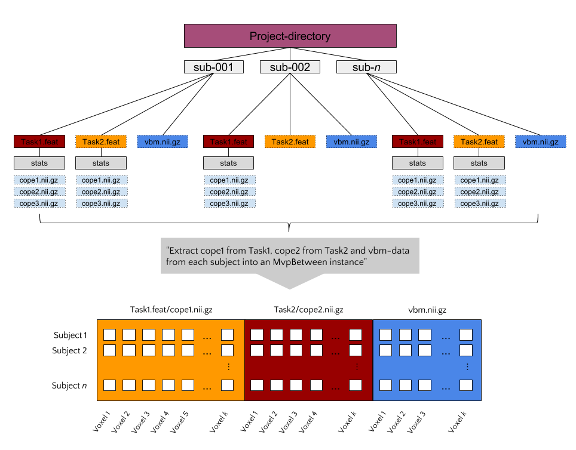

MvpResults: model evaluation and feature visualization
------------------------------------------------------
Given that an appropriate ``Mvp``-object exists, it is really easy to
implement a machine learning analysis using standard *scikit-learn*
modules. However, as fMRI datasets are often relatively small, K-fold
cross-validation is often performed to keep the training-set as large as
possible. Additionally, it might be informative to visualize which features
are used and are most important in your model. (But, note that feature mapping
should not be the main objective of decoding analyses!) Doing this - model
evaluation and feature visualization across multiple folds - complicates the
process of implementing machine learning pipelines on fMRI data.

The ``MvpResults`` object offers a solution to the above complications. Simply
pass your scikit-learn pipeline to MvpResults after every fold and it
automatically calculates a set of model evaluation metrics (accuracy,
precision, recall, etc.) and keeps track of which features are used and how
'important' these features are (in terms of the value of their weights).

Feature selection/extraction
----------------------------
The ``feature_selection`` and ``feature_extraction`` modules in skbold contain
a set of scikit-learn type transformers that can perform various types of
feature selection and extraction specific to multivoxel fMRI-data.
For example, the RoiIndexer-transformer takes a (partially masked) whole-brain
pattern and indexes it with a specific region-of-interest defined in a
nifti-file. The transformer API conforms to scikit-learn transformers, and as
such, (almost all of them) can be used in scikit-learn pipelines.

To get a better idea of the package's functionality - including the use of
Mvp-objects, transformers, and MvpResults - a typical analysis workflow using
``skbold`` is described below.

For some example usages of the ``Mvp``-objects and how to incorporate them
in a ``scikit-learn``-based ML-pipeline, check the examples below:

An example workflow: MvpWithin
------------------------------
Suppose you have data from an fMRI-experiment for a set of subjects who were
presented with images which were either emotional or neutral in terms of their
content. You've modelled them using a single-trial GLM (i.e. each trial is
modelled as a separate event/regressor) and calculated their corresponding
contrasts against baseline. The resulting FEAT-directory then contains
a directory ('stats') with contrast-estimates (COPEs) for each trial. Now,
using MvpWithin, it is easy to extract a sample by features matrix and some
meta-data associated with it, as shown below.

.. code:: python

   from skbold.core import MvpWithin

   feat_dir = '~/project/sub001.feat'
   mask_file = '~/GrayMatterMask.nii.gz' # mask all non-gray matter!
   read_labels = True # parse labels (targets) from design.con file!
   remove_contrast = ['nuisance_regressor_x'] # do not load nuisance regressor!
   ref_space = 'epi' # extract patterns in functional space (alternatively: 'mni')
   statistic = 'tstat' # use the tstat*.nii.gz files (in *.feat/stats) as patterns
   remove_zeros = True # remove voxels which are zero in each trial

   mvp = MvpWithin(source=feat_dir, read_labels=read_labels,
                   remove_contrast=remove_contrast, ref_space=ref_space,
                   statistic=statistic, remove_zeros=remove_zeros,
                   mask=mask_file)

   mvp.create() # extracts and stores (meta)data from FEAT-directory!
   mvp.write(path='~/', name='mvp_sub001') # saves to disk!

Now, we have an Mvp-object on which machine learning pipeline can be applied:

.. code:: python

   import joblib
   from sklearn.preprocessing import StandardScaler
   from sklearn.svm import SVC
   from sklearn.pipeline import Pipeline
   from sklearn.model_selection import StratifiedKFold
   from sklearn.metrics import accuracy_score, f1_score
   from skbold.feature_selection import fisher_criterion_score, SelectAboveCutoff
   from skbold.feature_extraction import RoiIndexer
   from skbold.postproc import MvpResults

   mvp = joblib.load('~/mvp_sub001.jl')
   roiindex = RoiIndexer(mvp=mvp,
                         mask='Amygdala',
                         atlas_name='HarvardOxford-Subcortical',
                         lateralized=False)  # loads in bilateral mask

   # Extract amygdala patterns from whole-brain
   mvp.X = roiindex.fit().transform(mvp.X)

   # Define pipeline
   pipe = Pipeline([
       ('scaler', StandardScaler()),
       ('anova', SelectAboveCutoff(fisher_criterion_score, cutoff=5)),
       ('svm', SVC(kernel='linear'))
   ])

   cv = StratifiedKFold(y=mvp.y, n_splits=5)

   # Initialization of MvpResults; 'forward' indicates that it keeps track of
   # the forward model corresponding to the weights of the backward model
   # (see Haufe et al., 2014, Neuroimage)
   mvp_results = MvpResults(mvp=mvp, n_iter=len(cv), feature_scoring='forward',
                            f1=f1_score, accuracy=accuracy_score)

   for train_idx, test_idx in cv.split(mvp.X, mvp.y):

       train, test = mvp.X[train_idx, :], mvp.X[test_idx, :]
       train_y, test_y = mvp.y[train_idx], mvp.y[train_idx]

       pipe.fit(train, train_y)
       pred = pipe.predict(test)

       mvp_results.update(test_idx, pred, pipeline=pipe) # update after each fold!

   mvp_results.compute_scores() # compute!
   mvp_results.write(out_path) # write file with metrics and niftis with feature-scores!

An example workflow: MvpBetween
-------------------------------
Suppose you have MRI data from a large set of subjects (let's say >50),
including (task-based) functional MRI, structural MRI (T1-weighted images,
DTI), and behavioral data (e.g. questionnaires, behavioral tasks). Such a
dataset would qualify for a *between subject* decoding analysis using the
MvpBetween object. To use the MvpBetween functionality effectively, it is
important that the data is organized sensibly. An example is given below.

In this example, each subject has three different data-sources: two FEAT-
directories (with functional contrasts) and one VBM-file. Let's say that we'd
like to use all of these sources of information together to predict some
behavioral variable, neuroticism for example (as measured with e.g. the
NEO-FFI). The most important argument passed to MvpBetween is ``source``.
This variable, a dictionary, should contain the data-types you want to extract
and their corresponding paths (with wildcards at the place of subject-specific
parts):

.. code:: python

   import os
   from skbold import roidata_path
   gm_mask = os.path.join(roidata_path, 'GrayMatter.nii.gz')

   source = dict(
       Contrast_t1cope1={'path': '~/Project_dir/sub*/Task1.feat/cope1.nii.gz'},
       Contrast_t2cope2={'path': '~/Project_dir/sub*/Task2.feat/cope2.nii.gz'},
       VBM={'path': '~/Project_dir/sub*/vbm.nii.gz', 'mask': gm_mask}
   )

Now, to initialize the MvpBetween object, we need some more info:

.. code:: python

   from skbold.core import MvpBetween

   subject_idf='sub-0??' # this is needed to extract the subject names to
                         # cross-reference across data-sources

   subject_list=None     # can be a list of subject-names to include

   mvp = MvpBetween(source=source, subject_idf=subject_idf, mask=None,
                    subject_list=None)

   # like with MvpWithin, you can simply call create() to start the extraction!
   mvp.create()

   # and write to disk using write()
   mvp.write(path='~/', name='mvp_between') # saves to disk!

This is basically all you need to create a MvpBetween object! It is very
similar to `MvpWithin` in terms of attributes (including ``X``, ``y``, and
various meta-data attributes). In fact, MvpResults works exactly in the same
way for MvpWithin and MvpBetween! The major difference is that MvpResults
keeps track of the feature-information for each feature-set separately and
writes out a summarizing nifti-file for each feature-set. Transformers also
work the same for MvpBetween objects/data, with the exception of the
cluster-threshold transformer.
